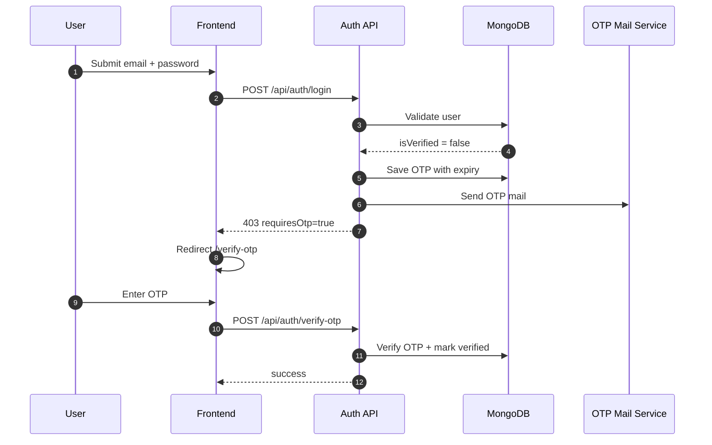
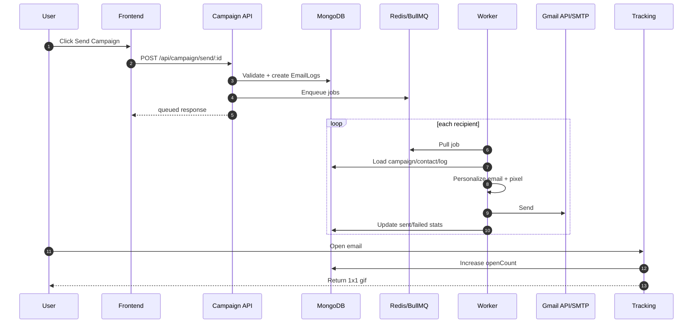

# MailPilot

MailPilot helps job seekers send personalized cold emails in bulk, automatically, within minutes.

Live deployment: https://mail-pilot-mu-one.vercel.app/

## 1. Product Aim

The aim of this product is simple:

- Help job seekers reach many recruiters and hiring teams very fast.
- Send customized cold emails in bulk without manual repetition.
- Automate the complete workflow from contact import to delivery.
- Track which recipients opened the email.

In short: within seconds, you can start outreach to 500+ people by email using one workflow.

## 2. Problem We Are Solving

Job seekers usually face these issues:

- They copy-paste similar emails repeatedly.
- They cannot easily personalize at scale.
- Sending manually is slow and error-prone.
- They do not know who opened their emails.
- Managing contacts/templates/campaigns across tools is messy.

## 3. How MailPilot Solves It

1. Import contacts in bulk (manual list, CSV, or API).
2. Create reusable templates with placeholders like {{name}} and {{company}}.
3. Generate or customize content quickly (including AI-assisted template generation).
4. Queue campaign sends with controlled pacing and retries.
5. Automatically deliver emails via Gmail API or SMTP path.
6. Track opens using a secure tokenized tracking pixel.
7. View status, delivery, failures, and open analytics in dashboard.

## 4. Core Product Features

- OTP-secured auth (register/login/forgot/reset flow).
- Bulk contact management with validation and CSV upload.
- Personalized template engine for each recipient.
- Campaign creation, scheduling, and send queue.
- Async worker architecture for reliable high-volume sending.
- Email-open tracking and analytics summary.
- Smart Email Scheduling with Timezone Optimization

## 5. High-Level Architecture

MailPilot uses a client-server + queue-worker design:

- Frontend: React + Vite SPA.
- API backend: Express + MongoDB.
- Queue: BullMQ on Redis.
- Worker: Processes queued email jobs.
- Providers: Gmail API and SMTP/Nodemailer.

### Runtime Flow

1. User interacts with dashboard in frontend.
2. Frontend calls REST APIs with JWT auth.
3. Backend validates/authenticates and persists to MongoDB.
4. Campaign send request creates EmailLog entries and enqueues jobs.
5. Worker consumes jobs, personalizes email, sends via provider.
6. Tracking endpoint updates open events.
7. Analytics endpoints return campaign and tracking metrics.

## 6. Design Patterns Used

### Layered Architecture

- Routes -> Controllers -> Services -> Models -> Utils.
- Keeps code modular and easy to maintain.

### Queue-Based Asynchronous Processing

- Email sending is handled out-of-band by workers.
- Prevents API timeouts for large campaigns.

### Middleware Pattern

- Auth, validation, rate-limit, error handling are centralized.

### Provider Strategy

- Same send flow can switch between Gmail API and SMTP.

## 7. Tech Stack

### Frontend

- React 18
- Vite
- React Router
- Axios
- Tailwind CSS
- React Toastify

### Backend

- Node.js + Express
- MongoDB + Mongoose
- Redis + BullMQ
- JWT + bcryptjs
- express-validator
- express-rate-limit
- helmet + cors
- nodemailer + googleapis
- winston

### Local Infra

- Docker Compose for MongoDB and Redis.

## 8. Why These Services

### MongoDB

- Stores users, OTP data, contacts, templates, campaigns, logs.
- Flexible schema for product iteration.

### Redis

- Stores queue state and delayed/retry jobs.

### BullMQ Worker

- Sends emails reliably in background with retries and backoff.

### Gmail API / SMTP

- Supports flexible sender setups across users.

### AI Assistant for Template Customization (Upcoming)

- AI-powered template generation tailored to job descriptions.
- Accelerates content creation with prompt-based customization.
- Ensures system reliability via deterministic fallback without API dependency.
## 9. Complete Project Structure

```text
MailPilot/
  docker-compose.yml
  package.json
  vercel.json
  README.md

  client/
    index.html
    package.json
    postcss.config.js
    tailwind.config.js
    vite.config.js
    vercel.json
    public/
    src/
      App.jsx
      main.jsx
      index.css
      components/
      context/
      hooks/
      pages/
      services/
      utils/

  server/
    package.json
    .env.example
    src/
      app.js
      server.js
      config/
      controllers/
      jobs/
      middlewares/
      models/
      queues/
      routes/
      services/
      utils/

  test-data/
    dummy-contacts.csv
```

## 10. API Modules

Base URL: http://localhost:4000/api

### Auth

- POST /auth/register
- POST /auth/verify-otp
- POST /auth/resend-otp
- POST /auth/login
- POST /auth/forgot-password
- POST /auth/reset-password
- GET /auth/google/url
- GET /auth/google/callback

### Users

- GET /users/me/settings
- GET /users/me/gmail/connect-url
- GET /users/gmail/callback
- PATCH /users/me/profile
- PATCH /users/me/password
- PATCH /users/me/settings

### Campaigns

- GET /campaign
- POST /campaign/create
- POST /campaign/send/:id
- GET /campaign/status/:id

### Contacts

- GET /contacts
- POST /contacts/bulk
- POST /contacts/upload
- PATCH /contacts/:id
- PATCH /contacts/:id/subscription

### Templates

- GET /templates
- POST /templates/ai-generate
- POST /templates
- PATCH /templates/:id
- DELETE /templates/:id

### Analytics and Tracking

- GET /analytics/summary
- GET /email-tracking
- GET /track
- GET /api/health

## 11. Request and Response Examples

Notes:

- Protected endpoints require Authorization: Bearer <jwt>
- Standard error shape: { "message": "..." }

### 1. Register

POST /auth/register

Request:

```json
{
  "email": "user@example.com",
  "password": "Str0ng@Pass",
  "name": "Demo User"
}
```

Response 202:

```json
{
  "message": "OTP sent to your email",
  "purpose": "register",
  "email": "u***@example.com",
  "expiresIn": 300,
  "resendAfter": 30
}
```

### 2. Login (Verified)

POST /auth/login

Response 200:

```json
{
  "token": "jwt-token",
  "user": {
    "id": "6610d4c7c1f0eac4f6b1f91a",
    "email": "user@example.com",
    "name": "Demo User",
    "isVerified": true
  }
}
```

### 3. Login (Unverified, OTP Auto-Sent)

POST /auth/login

Response 403:

```json
{
  "message": "Email not verified. OTP sent to your email.",
  "requiresOtp": true,
  "purpose": "register",
  "email": "u***@example.com",
  "expiresIn": 300,
  "resendAfter": 30
}
```

### 4. Create Campaign

POST /campaign/create

Request:

```json
{
  "name": "SE Outreach",
  "subject": "Application for {{company}}",
  "content": "<p>Hello {{name}}</p>",
  "textContent": "Hello {{name}}",
  "contactIds": ["6610d9c6c1f0eac4f6b1f925"],
  "scheduledAt": "2026-04-06T08:00:00.000Z"
}
```

Response 201:

```json
{
  "campaign": {
    "_id": "6610e0b1c1f0eac4f6b1f940",
    "name": "SE Outreach",
    "status": "pending"
  }
}
```

### 5. Send Campaign

POST /campaign/send/:id

Response 200:

```json
{
  "message": "Campaign queued for delivery",
  "campaign": {
    "_id": "6610e0b1c1f0eac4f6b1f940",
    "status": "processing",
    "stats": {
      "total": 120,
      "sent": 0,
      "failed": 0
    }
  }
}
```

### 6. Contacts Bulk Import

POST /contacts/bulk

Request:

```json
{
  "contacts": [
    {
      "email": "candidate@example.com",
      "name": "Candidate Name",
      "company": "Example Inc"
    }
  ]
}
```

Response 201:

```json
{
  "contactIds": ["6610d9c6c1f0eac4f6b1f925"],
  "count": 1
}
```

### 7. Analytics Summary

GET /analytics/summary

Response 200:

```json
{
  "summary": {
    "totalCampaigns": 12,
    "totalRecipients": 1200,
    "totalSent": 1100,
    "totalFailed": 100,
    "pendingCampaigns": 2,
    "processingCampaigns": 1,
    "completedCampaigns": 9,
    "deliveryRate": 91.66,
    "failureRate": 8.33,
    "successRate": 91.66
  }
}
```

### 8. Email Tracking List

GET /email-tracking?page=1&limit=10&sort=recently-opened

Response 200:

```json
{
  "items": [
    {
      "campaignName": "SE Outreach",
      "opened": true,
      "openCount": 3,
      "email": "candidate@example.com"
    }
  ],
  "pagination": {
    "page": 1,
    "limit": 10,
    "total": 1,
    "totalPages": 1,
    "hasNextPage": false,
    "hasPrevPage": false
  }
}
```

## 12. Sequence Diagrams

### Login with OTP for Unverified User



### Campaign Send Pipeline



## 13. Queue and Worker Flow

1. User sends campaign.
2. API validates campaign and recipient list.
3. Email logs are created in queued state.
4. Jobs are added to BullMQ with delay, jitter, retry policy.
5. Worker consumes jobs and sends email through configured provider.
6. Stats are updated in campaign and email logs.
7. Campaign status moves to completed when all recipients are done.

## 14. Personalization and Tracking

### Personalization Tokens

- {{name}}
- {{email}}
- {{company}}
- {{role}}

### Tracking

- Each email log receives a signed tracking token.
- Worker appends tracking pixel URL to email HTML.
- /track endpoint increments open count and open history.

## 15. Environment Configuration

Use server/.env.example as baseline.

Key variable groups:

- HTTP/CORS: PORT, FRONTEND_URL, BACKEND_PUBLIC_URL
- Database/Queue: MONGODB_URI, REDIS_HOST, REDIS_PORT
- Auth: JWT_SECRET, JWT_EXPIRES_IN, OTP expiry/cooldown
- Email: provider settings, Gmail OAuth, SMTP credentials
- Worker: RUN_EMAIL_WORKER, concurrency, rate limits
- AI: OPENAI_API_KEY, OPENAI_MODEL

## 16. Local Development Setup

### Prerequisites

- Node.js 18+
- npm
- Docker Desktop

### Steps

1. Install dependencies:

```bash
npm install
```

2. Start MongoDB + Redis:

```bash
npm run docker:up
```

3. Copy env file:

- Copy server/.env.example to server/.env
- Fill required values

4. Start full app:

```bash
npm run dev
```

### Optional Separate Worker Mode

1. Set RUN_EMAIL_WORKER=false in server/.env.
2. Start API and worker separately:

```bash
npm run dev:server
npm run worker -w server
npm run dev:client
```

## 17. Deployment Notes

- Live app: https://mail-pilot-mu-one.vercel.app/
- Frontend can be hosted on Vercel (client/dist).
- Backend needs MongoDB + Redis in production.
- Set proper CORS origins and BACKEND_PUBLIC_URL for tracking.
- Keep JWT and encryption secrets secure.

## 18. Core Outreach Flow for Job Seekers

1. Upload/import recruiter contacts.
2. Create one smart template with personalization fields.
3. Launch campaign to hundreds of recipients quickly.
4. Let queue + worker automate safe sending.
5. Track who opened your emails and prioritize follow-ups.

This is the core promise of MailPilot: fast, personalized, automated cold outreach for job seekers at scale.
